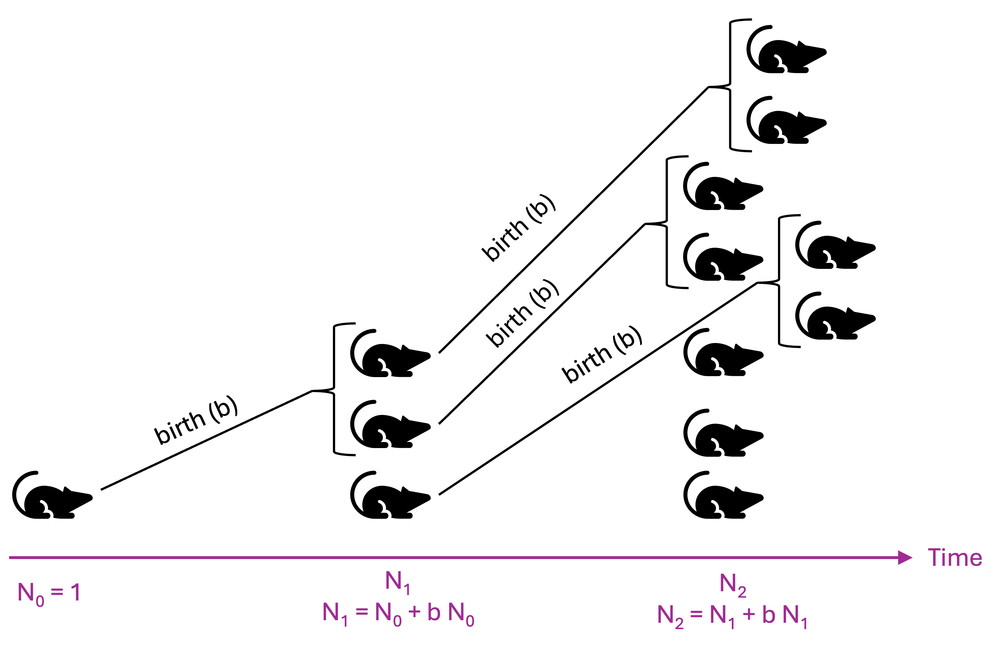

# Mathematical Models in Biology

```{r setup, include=FALSE}
knitr::opts_chunk$set(echo = TRUE)
```

## Lesson preamble

> ### Learning Objectives
>
> -   Understand the utility of mathematical models in biology
>
> -   Recognize the difference between mathematical models and other types of "models"
>
> -   Simulate simple models of population growth in R
>
> -   Understand the different assumptions and outputs of deterministic vs stochastic models

------------------------------------------------------------------------

```{r packages, message=FALSE, warning=FALSE}
library(tidyverse)
```

## An introduction to mathematical modeling in biology

### What are mathematical models?

Mathematical models are descriptions of biological processes that are based on our [understanding of the underlying mechanisms]{.underline} producing our observations.

Most commonly, mathematical models describe the [dynamic processes]{.underline} that lead to changes in the quantity or distribution of some entity. For example, the number of individuals of a particular species in a particular population can change due to births and deaths, which can be influenced by resource availability, competition or predation from other species, the genotype and phenotype of individuals, disease, weather, and chance events.

Typically, models describe idealized simplifications of complex biological processes, and can help us build intuition and understanding for how those processes may unfold in nature.

There are many uses of the word "model" in biology that *do not* refer to mathematical models

-   (Mental) model - conceptual framework for understanding a process

-   Model organisms - commonly-used study organisms like *E. coli*, *Arabidopsis*, or lab mice

-   Statistical (or machine learning) model - a mathematical description of a trend seen in data or a data-generating process, but without any particular connection to the underlying biological process

### What do we need models for?

Mathematical models help us

-   clarify assumptions we may have about how complex systems work
-   build understanding of how complex systems behave and why
-   *generate* predictions and hypothesis
-   *test* predictions and hypothesis based on analysis of the model (or fitting the model to data)
-   determine what data is needed to learn about something (of if it is possible to, given the data that is available, reliably infer parameters of interest)
-   determine in what ways certain kinds of data may be problematic or biased

### Types of mathematical models

There are many many types of mathematical models, and lots of ways to classify them! Some terms you will hear if you continue to be exposed to modeling include

-   model [scale]{.underline}: this could range from atomic (e.g., protein folding) to molecular (e.g., enzyme binding, gene expression) to cellular (e.g., virus infection, cancer growth) to population-level (e.g., species competition) and beyond

-   single species or multi-species

-   1 dimension vs 2D or 3D

-   linear vs non-linear (e.g., growth)

-   deterministic vs stochastic (e.g., outcome depends on random events)

-   model purpose: e.g., basic exploration, hypothesis testing, parameter estimation, scenario comparison, prediction

### Challenge

Match the famous mathematical models in biology with their creators and decade of creation

| Model | Creator | Date |
|------------------------|------------------------|------------------------|
| Genetic drift | Thomas Malthaus | 1910 |
| Enzyme binding kinetics | Ronald Fisher + Seawall Wright | 1860 |
| Inheritance of discrete genetic traits in diploid organisms | Alfred Lotka + Vito Volterra | 1920 |
| Smallpox vaccination | Gregor Mendel | 1790 |
| Predator-prey interactions | Daniel Bernoulli | 1910 |
| Exponential human population growth | Leonor Michaelis + Maude Menton | 1760 |

## Simple models of population growth

Let's start by considering the simplest possible model of population growth. We'll assume

-   all individuals reproduce only once per generation, at the exact same time

-   all individuals have exactly $b$ offspring (births) each generation

-   there is no death

-   the population is closed: there is no immigration and no emigration

-   there is no stochasticity: individuals do not, by chance, give birth to more/fewer offspring



While this model could perhaps apply to bacterial cells growing in a petri dish or a plant growing in an isolated, optimized greenhouse, there is obviously no real system that satisfies all these very strong assumptions. However, when modeling, it's helpful to first understand the simplest models before moving on to more complicated ones.

Let $N_t$ be the number of individuals at times $t=0,1,2,3,\dots$. Let $N_0$ be the initial number of individuals in the population. Then, we can write down a rule - or recursive equation - for the population size at generation $t+1$ in terms of the *population size at the previous generation*

$N_{t+1} = N_t + b N_t= (1+b)N_t$

We can write a simple algorithm to calculate $N_t$

```{r}

N_0 <- 1
b <- 2
t_max <- 1
  
N <- N_0

for (t in 1:t_max){
  N <- N + b*N
}

print(N)
```

Let's try it for a few different values? Does it seem to be working?

If we want to make a plot of the population growth over time, we need to keep track of the population size at each time

```{r}

N_0 <- 1
b <- 2
t_max <- 10

t_vec <- 0:t_max
N_vec <- rep(0, length(t_vec))
  
N_vec[1] <- N_0

for (i in 1:t_max){
  N_vec[i+1] <- N_vec[i]*(1+b)
}

print(t_vec)
print(N_vec)
```

Now let's plot it!

```{r}

model_output <- data.frame(time = t_vec, N = N_vec)

model_output %>% ggplot(aes(x = time, y = N)) + 
  geom_line() +
  geom_point()  + 
  scale_y_log10(name = "Population size N(t)")+
  scale_x_continuous(name = "Time (t)", breaks = 0:max(model_output$time))
```

What does this graph look like?

Let's plot on a log scale to confirm

```{r}
model_output %>% ggplot(aes(x = time, y = N)) + 
  geom_line() +
  geom_point() +
  
  scale_y_log10(name = "Population size N(t)")+
  scale_x_continuous(name = "Time (t)", breaks = 0:max(model_output$time))
```

Let's try to generalize this model a little bit more:

-   Instead of thinking of each timestep $t$ as a synchronized generation where everyone reproduces, we could alternatively think of it as a shorter timeframe (like an hour, day, or week) where only a subset of individuals reproduce

-   Instead of thinking about $b$ as the total number of offspring each individual prouces each generation, we can reframe it as the average number of offspring produced in that time period for a population where reproduction is NOT synchronized. For example, if on average individuals have 2 offspring every year, but, like humans, reproduction can occur anytime during the year, and we instead want to model the population size each month, we could use $b = 2/12 \sim 0.17$.

-   we can include death: each timestep, some fraction of individuals $d$ will die

Now we have our update rule is

$N_{t+1} = N_t + b N_t - d N_t= (1+b-d)N_t$

Let's update our simulation, turning it into a function so that we can easily simulate it for multiple different parameter values

```{r}
N_0 <- 1
b <- 2/12 # per month
d <- 1/12 # per month
t_max <- 100 # months

sim_birth_death <- function(N_0, b, d, t_max){
  
  t_vec <- 0:t_max
  N_vec <- rep(0, length(t_vec))
    
  N_vec[1] <- N_0
  
  for (i in 1:t_max){
    N_vec[i+1] <- N_vec[i]*(1+b-d)
  }
  
  return(list(time = t_vec,N = N_vec))
  
}

model_output <- as.data.frame(sim_birth_death(N_0, b, d, t_max)) %>%
  mutate(params = "b = 2, d = 1 /yr") %>%
  rbind(as.data.frame(sim_birth_death(N_0, 1.5/12, d, t_max)) 
        %>% mutate(params = "b = 1.5, d = 1 /yr")) %>%
  rbind(as.data.frame(sim_birth_death(N_0, 2/12, 0.7/12, t_max)) 
        %>% mutate(params = "b = 1, d = 0.7/yr"))


model_output %>% ggplot(aes(x = time/12, y = N, color = params)) + 
  geom_line() +
  geom_point() +
  scale_y_continuous(name = "Population size N(t)") + 
  scale_x_continuous(name = "Time(t), years", breaks = 0:max(model_output$time)) + 
  scale_color_discrete((name = "Parameters"))
```

Alternatively, we can plot this on a log scale

```{r}

model_output %>% ggplot(aes(x = time/12, y = N, color = params)) + 
  geom_line() +
  geom_point() +
  scale_y_log10(name = "Population size N(t)") + 
  scale_x_continuous(name = "Time(t), years", breaks = 0:max(model_output$time)) + 
  scale_color_discrete((name = "Parameters"))

```

Note that when we have changed our parameters ($b,d$) into rates per time instead of integer values, our population size $N$ is no longer restricted to integer values either. Therefore in this case, $N$ is better thought of as the average population size or a measure of population density.

Did we really need to write a for-loop for this sort of model? Let's try to work out what we expect to see at each generation in this model

$$N_{1} = (1+b-d) N_0$$ $$N_{2} = (1+b-d) N_1 = (1+b-d)(1+b-d) N_0$$ $$N_{3} = (1+b-d) N_{2} = (1+b-d) (1+b-d)^2 N_0 = (1+b-d)^3 N_0$$

In general, $N_{t} = (1+b-d)^t N_0$ for all $t$. We can replace $(1+b-d)$ with $R$, the net growth rate, then we have

$N_t = R^t N_0$

When $b>d$ or $R > 1$, the population is said to *grow geometrically*, in that the growth rate $R$ is being raised to a power equal to the number of timesteps (e.g., generations) that have passed. If $R<1$, the population will shrink

Moreover, it is sometimes convenient in discrete time models like this to describe the dynamics in terms of how variables *change* from one time to the next. In the case of the geometric growth model, we can express the dynamics in terms of change in absolute population size.

$$\Delta N_t \equiv N_{t+1} - N_t = (1+b-d) N_t - N_t = (b-d) N_t.$$

In population ecology, $(b-d)$ is called the *intrinsic rate of increase or decrease*, and often denoted $r$. If positive, the population grows in a given generation. If negative, it becomes smaller.

This model is an example of a [deterministic, discrete time, dynamic model]{.underline}.

### Exponential growth

Continuous-time analogues of discrete-time equations are written as differential equations. We'll get to this more in the next class, but for now, we can see the connection. When we used a timestep of size one, we wrote

$$
\Delta N_t = (b-d) N_t
$$

If we want to re-scale the equation to use a smaller, fractional, timestep (like we did above when changing from years to months), we re-write things as

$$
N_{t+\Delta t} - N_t = (b-d) \Delta t  N_t
$$

Or as

$$
N_{t+\Delta t} - N_t = (b \Delta t -d \Delta t )  N_t
$$

which is why we scaled our rate parameters down to $b' = b \Delta t$ in the previous example. Finally, we can re-arrange this to

$$
 \frac{\Delta N_t}{\Delta t}  =  (b -d) N_t
$$

If we assume time-steps are small, we can replace the differences ($\Delta N, \Delta t$) in the previous equation with an *infinitesimal* differences ($d N, dt$), and then use the derivative to describe the dynamics of a population changing in continuous time as a *differential equation*:

$$\frac{d N}{dt} = (b-d) N = r N$$subject to $N(0) = N_0$.

Like the geometric growth equation, we can solve this equation exactly. Diving through by $N$ and using properties of derivatives from calculus,

$$\frac{1}{N} \frac{d N}{d t} = \frac{d \ln N}{d t} = r.$$ This equation tells us that, in the continuous time version of the growth model above, the per-capita (i.e., *logarithmic*) rate of increase in the population size is constant. Integrating and applying the initial condition, one can show that the solution to this equation is $N(t) = N_0 e^{r t}$. If $r > 0$, i.e., $b > d$, then the population grows exponentially; if $r < 0$, the population will decay exponentially in size to zero. The trajectory of the population is completely determined in a deterministic model like this one by the parameters (i.e., the intrinsic growth rate) and initial conditions.

## Simulating stochastic population dynamics

So far the models we've examined are *deterministic*, meaning that they prescribe exactly how many individuals we'll have at each timestep, and each time we run the model with the same initial conditions and parameters, we'll get the same output value. However, in the real world, random events, or *stochasticity*, can lead to variability in population sizes even when the expectation is the same.

Stochastic events are extremely important in biology - they are responsible for processes like **mutation**, **genetic drift**, and **extinction**, for example.

Since we know how to draw random numbers ([Lecture 7](lec07-random-variables) and [Lecture 8](lec08-inference)), we can simulate stochastic models!

Let's return to our simple discrete-generation model of population growth:

$N_{t+1} = r N_t$

We'll assume that in each generation (timestep), the original individuals produce $r$ offspring and then die. However, let's assume there is some variability in the number of offspring each individual produced. If we think about it as there being a constant rate of reproduction during their life with each birth being independent, then we could think of it as a Poisson process (i.e., the number of offspring is Poisson distributed):

$$
N_{t+1} = \sum_{N_t} \textrm{Poiss}(r) = \textrm{Poiss}(r N_t) 
$$

where the second equal sign is due to a useful property of the Poisson distribution!

Assume a 1000 new populations are seeded via a migration event with a single individual from a source population (e.g., seed dispersal). We can calculate the distribution of individuals in the second generation, and how it depends on the values of $r$ (let's try $r = 0.7, 1, 1.5, 3, 10$ for now)

```{r}
# Number of seeding events creating new populations
n_seeds <- 1000

# r values to simulate
r_values <- c(0.7, 1, 1.5, 3, 10)

# Sample the number of secondary infections
df <- data.frame()
for(r in r_values){
  df <- rbind(df, data.frame(r = r, offspring= rpois(n_seeds, r)))
}

ggplot(df, aes(offspring, fill = factor(r))) +
  geom_histogram(binwidth = 1) +
  facet_wrap(~r) +
  theme_bw() +
  labs(x = "Number of Offspring in 2nd Generation", fill = "r")
```

### Challenge

What percent of newly seeded populations go extinct after a single generation for each $r$ value? Anything about the results that surprise you?

```{r, include = F}

df %>% group_by(r) %>%
  summarise(f = sum(offspring == 0)/n())
```

Now, let's simulate multiple generations of growth. We want to start with a single individual, and then examine the population size at a later time

```{r}

N_0 <- 1
r <- 1.5
t_max <- 10

t_vec <- 0:t_max
N_vec <- rep(0, length(t_vec))

N_vec[1] <- N_0

for (i in 1:t_max){
  N_vec[i+1] <-rpois(1,  N_vec[i]*r)
}

model_output <- data.frame(time = t_vec, N = N_vec)

model_output %>% ggplot(aes(x = time, y = N)) + 
  geom_line() +
  geom_point() +
  scale_y_continuous(name = "Population size N(t)") + 
  scale_x_continuous(name = "Time(t)", breaks = 0:max(model_output$time)) 
```

Let's turn this into a function, and return more example trajectories

```{r}
N_0 <- 1
r <- 1.5
t_max <- 10

sim_stoch_growth <- function(N_0, r, t_max){
  
  t_vec <- 0:t_max
  N_vec <- rep(0, length(t_vec))

  N_vec[1] <- N_0

  for (i in 1:t_max){
    N_vec[i+1] <-rpois(1,  N_vec[i]*r)
  }
  
  return(N = N_vec)
  
}

model_output <- data.frame()

for(i in 1:10){
    model_output <- rbind(model_output, data.frame(time = 0:t_max, N = sim_stoch_growth(N_0, r, t_max), r=r, i= i))
}

model_output %>% ggplot(aes(x = time, y = N, color = as.factor(i))) + 
  geom_line() +
  geom_point() +
  scale_y_continuous(name = "Population size N(t)") + 
  scale_x_continuous(name = "Time(t)", breaks = 0:max(model_output$time)) +
  scale_color_discrete(name = "Iteration")
```

Instead, let's look at the distribution of the population sizes at the end of the time period (10 generations here).

```{r}
model_output %>% filter(time == t_max) %>% ggplot(aes(x = N)) + 
  geom_histogram(binwidth = 1) +
  theme_bw()
```

Let's increase the number of independent populations we seed, and try a few different $r$ values

```{r}

N_0 <- 1
t_max <- 10

model_output <- data.frame()

for(r in c(0.7, 0.9, 1, 1.5, 2)){
  for(i in 1:1000){
      model_output <- rbind(model_output, data.frame(time = 0:t_max, N = sim_stoch_growth(N_0, r, t_max), r=r, i= i))
  }
}

model_output %>% filter(time == t_max) %>% ggplot(aes(x = N, fill = factor(r))) + 
  geom_histogram() + 
  facet_wrap(~r, scales = "free_x") +
  labs(x = "Population size after 10 generations", fill = "growth rate (r)")
```

Note that this same simple stochastic model can be used for lots of processes other than simple growth! In fact, it's a commonly used way to model the spread of infectious diseases during the early phase of an outbreak, where $r$ is the basic reproduction number (often called $R_0$) of the outbreak, describing the average number of secondary infections before recovery (or death).

## Further reading

A great introductory textbook on mathematical modeling is : Sarah Otto & Troy Day, "**A Biologists Guide to Mathematical Modeling in Ecology & Evolution**". 2007. Princeton University Press. It's available online for free from the U of T Library
